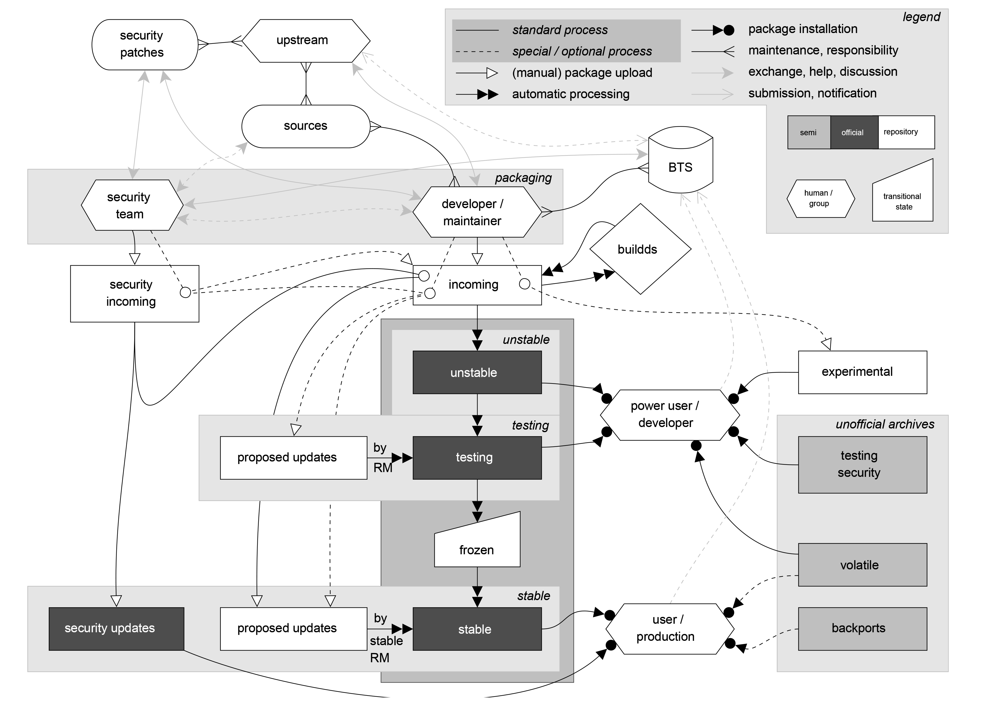

# learn-debian


## 本仓库内容

1. debian学习笔记

```
Something I hope you know before go into the coding~
First, please watch or star this repo, I'll be more happy if you follow me.
Bug report, questions and discussion are welcome, you can post an issue or pull a request.
```

## 相关站点

* GitHub地址:<https://github.com/yifengyou/learn-debian>
* GitBook地址:<https://yifengyou.gitbooks.io/learn-debian/content/>
* GitPage:<https://yifengyou.github.io/learn-debian/>


## 目录

* [debian简介](docs/debian简介.md)
* [debian安装](docs/debian安装.md)
* [deb包管理](docs/deb包管理.md)
    * [dpkg](docs/deb包管理/dpkg.md)
    * [apt](docs/deb包管理/apt.md)
* [deb包构建](docs/deb包构建.md)
    * [deb包命名规范](docs/deb包构建/deb包命名规范.md)
    * [debian源码包组成](docs/deb包构建/debian源码包组成.md)
        * [debian\/control](docs/deb包构建/debian源码包组成/control.md)
        * [debian\/changelog](docs/deb包构建/debian源码包组成/changelog.md)
        * [debian\/copyright](docs/deb包构建/debian源码包组成/copyright.md)
        * [debian\/rules](docs/deb包构建/debian源码包组成/rules.md)
        * [其他](docs/deb包构建/debian源码包组成/其他.md)
            * [debian\/README.debian](docs/deb包构建/debian源码包组成/其他/README_debian.md)
            * [debian\/compat](docs/deb包构建/debian源码包组成/其他/compat.md)
            * [debian\/conffiles](docs/deb包构建/debian源码包组成/其他/conffiles.md)
            * [debian\/package.cron.*](docs/deb包构建/debian源码包组成/其他/packagecron.md)
            * [debian\/package.doc-base](docs/deb包构建/debian源码包组成/其他/packagedocbase.md)
            * [debian\/patches](docs/deb包构建/debian源码包组成/其他/patches.md)
            * [debian\/install](docs/deb包构建/debian源码包组成/其他/install.md)
            * [debian\/NEWS](docs/deb包构建/debian源码包组成/其他/NEWS.md)
            * [debian\/TODO](docs/deb包构建/debian源码包组成/其他/TODO.md)
            * [debian\/watch](docs/deb包构建/debian源码包组成/其他/watch.md)
            * [debian\/dirs](docs/deb包构建/debian源码包组成/其他/dirs.md)
            * [debian\/docs](docs/deb包构建/debian源码包组成/其他/docs.md)
            * [debian\/source\/format](docs/deb包构建/debian源码包组成/其他/source_format.md)
            * [debian\/patches\/*](docs/deb包构建/debian源码包组成/其他/patches.md)
    * [debuild(src:devscripts)](docs/deb包构建/debuild.md)
    * [sbuild(src:sbuild)](docs/deb包构建/sbuild.md)
    * [pbuilder(src:pbuilder)](docs/deb包构建/pbuilder.md)
    * [cowbuilder(src:cowbuilder)](docs/deb包构建/cowbuilder.md)
    * [gbp buildpackage(src:git-buildpackage)](docs/deb包构建/gbpbuildpackage.md)
    * [dpkg-buildpackage(src:dpkg-dev)](docs/deb包构建/dpkg-buildpackage.md)
    * [debhelper(src:debhelper)](docs/deb包构建/debhelper.md)
        * [\/usr\/bin\/dh](docs/deb包构建/debhelper/dh.md)
        * [\/usr\/bin\/dh_auto_build](docs/deb包构建/debhelper/dh_auto_build.md)
        * [\/usr\/bin\/dh_auto_clean](docs/deb包构建/debhelper/dh_auto_clean.md)
        * [\/usr\/bin\/dh_auto_configure](docs/deb包构建/debhelper/dh_auto_configure.md)
        * [\/usr\/bin\/dh_auto_install](docs/deb包构建/debhelper/dh_auto_install.md)
        * [\/usr\/bin\/dh_auto_test](docs/deb包构建/debhelper/dh_auto_test.md)
        * [\/usr\/bin\/dh_bugfiles](docs/deb包构建/debhelper/dh_bugfiles.md)
        * [\/usr\/bin\/dh_builddeb](docs/deb包构建/debhelper/dh_builddeb.md)
        * [\/usr\/bin\/dh_clean](docs/deb包构建/debhelper/dh_clean.md)
        * [\/usr\/bin\/dh_compress](docs/deb包构建/debhelper/dh_compress.md)
        * [\/usr\/bin\/dh_dwz](docs/deb包构建/debhelper/dh_dwz.md)
        * [\/usr\/bin\/dh_fixperms](docs/deb包构建/debhelper/dh_fixperms.md)
        * [\/usr\/bin\/dh_gconf](docs/deb包构建/debhelper/dh_gconf.md)
        * [\/usr\/bin\/dh_gencontrol](docs/deb包构建/debhelper/dh_gencontrol.md)
        * [\/usr\/bin\/dh_icons](docs/deb包构建/debhelper/dh_icons.md)
        * [\/usr\/bin\/dh_install](docs/deb包构建/debhelper/dh_install.md)
        * [\/usr\/bin\/dh_installcatalogs](docs/deb包构建/debhelper/dh_installcatalogs.md)
        * [\/usr\/bin\/dh_installchangelogs](docs/deb包构建/debhelper/dh_installchangelogs.md)
        * [\/usr\/bin\/dh_installcron](docs/deb包构建/debhelper/dh_installcron.md)
        * [\/usr\/bin\/dh_installdeb](docs/deb包构建/debhelper/dh_installdeb.md)
        * [\/usr\/bin\/dh_installdebconf](docs/deb包构建/debhelper/dh_installdebconf.md)
        * [\/usr\/bin\/dh_installdirs](docs/deb包构建/debhelper/dh_installdirs.md)
        * [\/usr\/bin\/dh_installdocs](docs/deb包构建/debhelper/dh_installdocs.md)
        * [\/usr\/bin\/dh_installemacsen](docs/deb包构建/debhelper/dh_installemacsen.md)
        * [\/usr\/bin\/dh_installexamples](docs/deb包构建/debhelper/dh_installexamples.md)
        * [\/usr\/bin\/dh_installgsettings](docs/deb包构建/debhelper/dh_installgsettings.md)
        * [\/usr\/bin\/dh_installifupdown](docs/deb包构建/debhelper/dh_installifupdown.md)
        * [\/usr\/bin\/dh_installinfo](docs/deb包构建/debhelper/dh_installinfo.md)
        * [\/usr\/bin\/dh_installinit](docs/deb包构建/debhelper/dh_installinit.md)
        * [\/usr\/bin\/dh_installlogcheck](docs/deb包构建/debhelper/dh_installlogcheck.md)
        * [\/usr\/bin\/dh_installlogrotate](docs/deb包构建/debhelper/dh_installlogrotate.md)
        * [\/usr\/bin\/dh_installman](docs/deb包构建/debhelper/dh_installman.md)
        * [\/usr\/bin\/dh_installmanpages](docs/deb包构建/debhelper/dh_installmanpages.md)
        * [\/usr\/bin\/dh_installmenu](docs/deb包构建/debhelper/dh_installmenu.md)
        * [\/usr\/bin\/dh_installmime](docs/deb包构建/debhelper/dh_installmime.md)
        * [\/usr\/bin\/dh_installmodules](docs/deb包构建/debhelper/dh_installmodules.md)
        * [\/usr\/bin\/dh_installpam](docs/deb包构建/debhelper/dh_installpam.md)
        * [\/usr\/bin\/dh_installppp](docs/deb包构建/debhelper/dh_installppp.md)
        * [\/usr\/bin\/dh_installsystemd](docs/deb包构建/debhelper/dh_installsystemd.md)
        * [\/usr\/bin\/dh_installudev](docs/deb包构建/debhelper/dh_installudev.md)
        * [\/usr\/bin\/dh_installwm](docs/deb包构建/debhelper/dh_installwm.md)
        * [\/usr\/bin\/dh_installxfonts](docs/deb包构建/debhelper/dh_installxfonts.md)
        * [\/usr\/bin\/dh_link](docs/deb包构建/debhelper/dh_link.md)
        * [\/usr\/bin\/dh_lintian](docs/deb包构建/debhelper/dh_lintian.md)
        * [\/usr\/bin\/dh_listpackages](docs/deb包构建/debhelper/dh_listpackages.md)
        * [\/usr\/bin\/dh_makeshlibs](docs/deb包构建/debhelper/dh_makeshlibs.md)
        * [\/usr\/bin\/dh_md5sums](docs/deb包构建/debhelper/dh_md5sums.md)
        * [\/usr\/bin\/dh_missing](docs/deb包构建/debhelper/dh_missing.md)
        * [\/usr\/bin\/dh_movefiles](docs/deb包构建/debhelper/dh_movefiles.md)
        * [\/usr\/bin\/dh_perl](docs/deb包构建/debhelper/dh_perl.md)
        * [\/usr\/bin\/dh_prep](docs/deb包构建/debhelper/dh_prep.md)
        * [\/usr\/bin\/dh_shlibdeps](docs/deb包构建/debhelper/dh_shlibdeps.md)
        * [\/usr\/bin\/dh_strip](docs/deb包构建/debhelper/dh_strip.md)
        * [\/usr\/bin\/dh_systemd_enable](docs/deb包构建/debhelper/dh_systemd_enable.md)
        * [\/usr\/bin\/dh_systemd_start](docs/deb包构建/debhelper/dh_systemd_start.md)
        * [\/usr\/bin\/dh_testdir](docs/deb包构建/debhelper/dh_testdir.md)
        * [\/usr\/bin\/dh_testroot](docs/deb包构建/debhelper/dh_testroot.md)
        * [\/usr\/bin\/dh_ucf](docs/deb包构建/debhelper/dh_ucf.md)
        * [\/usr\/bin\/dh_update_autotools_config](docs/deb包构建/debhelper/dh_update_autotools_config.md)
        * [\/usr\/bin\/dh_usrlocal](docs/deb包构建/debhelper/dh_usrlocal.md)
    * [cdbs(src:cdbs)](docs/deb包构建/cdbs.md)
        * [\/usr/bin\/cdbs-edit-patch](docs/deb包构建/cdbs/cdbs-edit-patch.md)
* [deb包安全](docs/deb包安全.md)
    * [deb包签名](docs/deb包安全/deb包签名.md)
* [apt软件源构建](docs/apt软件源构建.md)
    * [apt软件源结构](docs/apt软件源构建/apt软件源结构.md)
        * [InRelease](docs/apt软件源构建/apt软件源结构/InRelease.md)
        * [Release](docs/apt软件源构建/apt软件源结构/Release.md)
        * [Release.gpg](docs/apt软件源构建/apt软件源结构/Release-gpg.md)
        * [Packages.xz](docs/apt软件源构建/apt软件源结构/Packages-xz.md)
        * [Packages.gz](docs/apt软件源构建/apt软件源结构/Packages-gz.md)
    * [aptly](docs/apt软件源构建/aptly.md)
* [apt软件源安全](docs/apt软件源安全.md)
    * [apt软件源签名](docs/apt软件源安全/apt软件源签名.md)

## 参考

* 《The Debian Administrator's Handbook》- Debian管理员手册
* <https://www.debian.org/doc/manuals/maint-guide/>
* <https://debian-handbook.info/browse/zh-CN/stable/>
* <http://shouce.jb51.net/linux-debian-learning/index.html>

---



