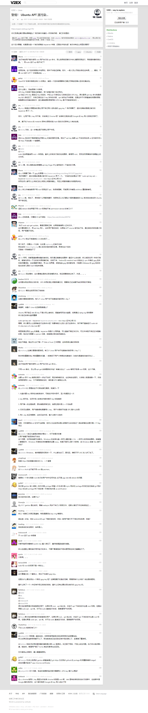
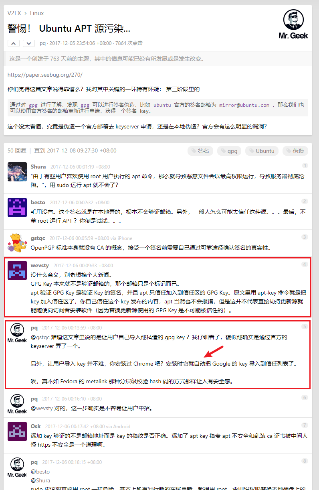
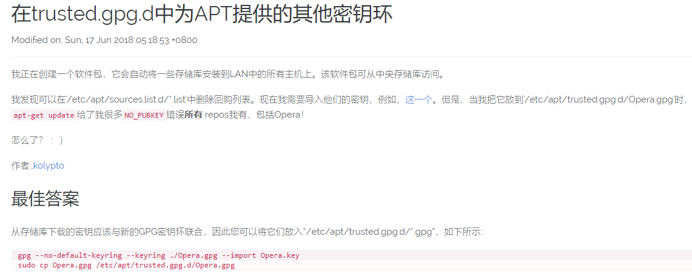
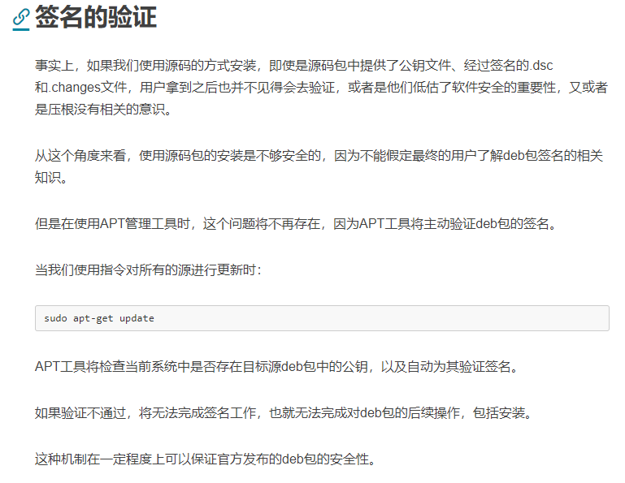
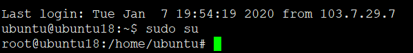
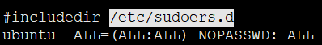

# apt软件源签名

* <https://paper.seebug.org/270/>

该文描述内容并非准确。

* <https://www.v2ex.com/t/412317>

其中

基本上，如果root权限运行一些软件，恶意gpg加入授信，基本就JJ了啊，就是这么简单的道理。所以sudo危害极大。。

上图说出了关键问题。

另外，有实用腾讯云的小伙伴~~

腾讯云的ubuntu系统sudo没有要求输入密码，安全性就比较麻烦了，就担心黑客ubuntu ubuntu进入为非作歹

因为软件默认ubuntu系统镜像的sudoers竟然是配置成NOPASSWD。安全起见，如果是用ubuntu镜像的修改这个地方。

## 参考

* <https://www.downeyboy.com/2019/05/29/mk_deb_pack_series_6/>
* <https://www.v2ex.com/t/412317>
* <https://paper.seebug.org/270/>
