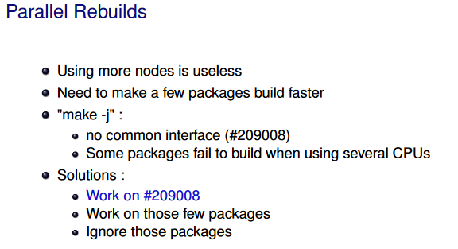

# pbuilder




## pbuilder包内容

```
[tbuild@VM ~]$ dpkg-query -L pbuilder

/etc/pbuilder
/etc/pbuilder/buildd-config.sh

/usr/bin/debuild-pbuilder
/usr/bin/pdebuild
/usr/sbin/pbuilder

/usr/lib/pbuilder/pbuilder-apt-config
/usr/lib/pbuilder/pbuilder-buildpackage
/usr/lib/pbuilder/pbuilder-buildpackage-funcs
/usr/lib/pbuilder/pbuilder-checkparams
/usr/lib/pbuilder/pbuilder-createbuildenv
/usr/lib/pbuilder/pbuilder-loadconfig
/usr/lib/pbuilder/pbuilder-modules
/usr/lib/pbuilder/pbuilder-runhooks
/usr/lib/pbuilder/pbuilder-satisfydepends-apt
/usr/lib/pbuilder/pbuilder-satisfydepends-aptitude
/usr/lib/pbuilder/pbuilder-satisfydepends-checkparams
/usr/lib/pbuilder/pbuilder-satisfydepends-classic
/usr/lib/pbuilder/pbuilder-satisfydepends-experimental
/usr/lib/pbuilder/pbuilder-satisfydepends-funcs
/usr/lib/pbuilder/pbuilder-satisfydepends-gdebi
/usr/lib/pbuilder/pbuilder-unshare-wrapper
/usr/lib/pbuilder/pbuilder-updatebuildenv
/usr/lib/pbuilder/pdebuild-checkparams
/usr/lib/pbuilder/pdebuild-internal

/usr/share/bash-completion
/usr/share/bash-completion/completions
/usr/share/bash-completion/completions/pbuilder

/usr/share/doc/pbuilder/AUTHORS

/usr/share/doc-base/pbuilder

/usr/share/man/man1/debuild-pbuilder.1.gz
/usr/share/man/man1/pdebuild.1.gz

/usr/share/man/man5/pbuilderrc.5.gz

/usr/share/man/man8/pbuilder.8.gz

/usr/share/pbuilder/pbuilderrc

/var/cache/pbuilder/aptcache
/var/cache/pbuilder/build
/var/cache/pbuilder/ccache
/var/cache/pbuilder/pbuildd
/var/cache/pbuilder/pbuilder-mnt
/var/cache/pbuilder/result

/usr/lib/pbuilder/pbuilder-satisfydepends
```

## 参考

* <https://pbuilder-docs.readthedocs.io/en/latest/>
* pbuilder、sbuild性能对比：<https://members.loria.fr/LNussbaum/files/fosdem07-auttest.pdf>
